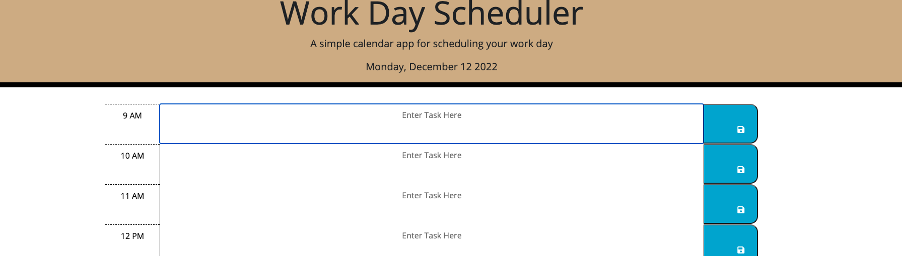
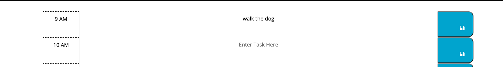

# WorkDayScheduler

## Description 

Create a simple calendar application that allows a user to save events for each hour of the day by modifying starter code. This app will run in the browser and feature dynamically updated HTML and CSS powered by jQuery. The workday hours are between 9 AM and 5pm which allows users to input a task in a time slot. The time slot are color coordinated by Past (grey), Present (red), and future (green).

## Images

The user can see that the landing page has the current date is displayed up top.

The user can save their task and the task will stay if they fresh the page.
## Website
https://kevinl206.github.io/WorkDayScheduler/
